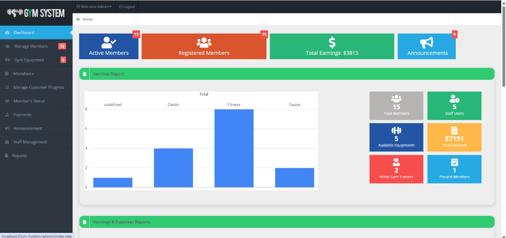
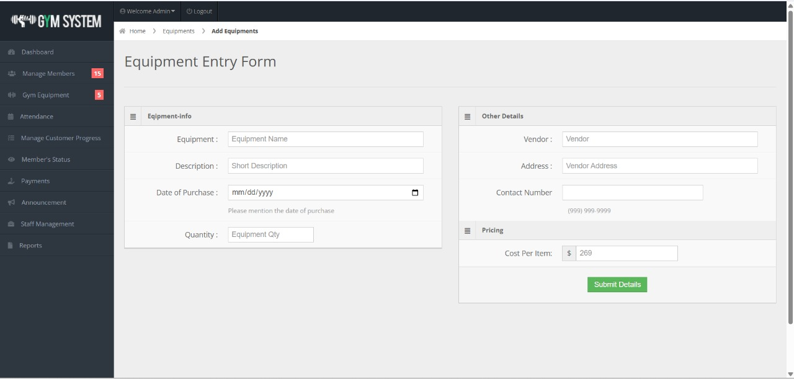

# Gym-System
# 🏋️‍♂️ Gym Membership Management System

A complete web-based Gym Membership System built using **PHP, MySQL, HTML, and CSS**, designed to manage gym members, trainers, classes, and payments efficiently.

> 🎓 Academic DBMS Project | 🧠 Built by Allwin E – B.Tech IT Student | 🚀 Scalable for real-world use

---

## 📸 Demo Preview

> Add screenshots here (optional)
- 
- 

---

## 🚀 Features

✅ Member Registration & Login  
✅ Admin Dashboard for full control  
✅ Trainer Information Management  
✅ Class Scheduling System  
✅ Payment History & Fee Tracking  
✅ Responsive User Interface  
✅ Exportable Reports via Database  
✅ Clean and Structured Code (PHP + MySQL)

---

## 🛠️ Tech Stack

| Technology | Usage |
|------------|--------|
| **Frontend** | HTML5, CSS3 |
| **Backend**  | PHP |
| **Database** | MySQL |
| **Local Server** | XAMPP |
| **Tools** | VS Code, phpMyAdmin |

---


---

## ⚙️ How to Run the Project Locally

1. 🔽 **Download or Clone** this repository:
   ```bash
   git clone https://github.com/AllwinE/Gym-Membership-System.git
2. 📁 **Copy the folder** to your XAMPP htdocs directory

3. 🛠️ **Start Apache and MySQL** using the XAMPP control panel

4. 🌐 **Open your browser** and go to:
      http://localhost/Gym-Membership-System/
5. 🗄️ **Open phpMyAdmin, create a new database** (e.g. gym), and import gym.sql from the db/ folder

6. 🏁 You're ready to go! **Login or register** and explore all features.
---

---

🎯 **Future Improvements**
✅ Mobile-friendly responsive design

✅ OTP/Email verification for signup

⌛ Trainer attendance system

⌛ Subscription plan manager

⌛ Export reports to Excel/PDF

⌛ Role-based login system (Admin, Staff, Trainer, Member)

---

👨‍💻 **Developed by**

**Allwin E**

🧑‍🎓 B.Tech IT – K. Ramakrishnan College of Engineering

🏆 Winner – ₹20,000 Prize @ Startup Mela 7.0

📬 Email: allwinedwinofficial@gmail.com

🌐 LinkedIn (Add yours later)

📃 License
This project is licensed under the MIT License.
Feel free to use, modify, and improve it with credit.

💡 “Strong bodies need strong code!”
Built with ❤️ by Allwin | For academic + real-world learning.
